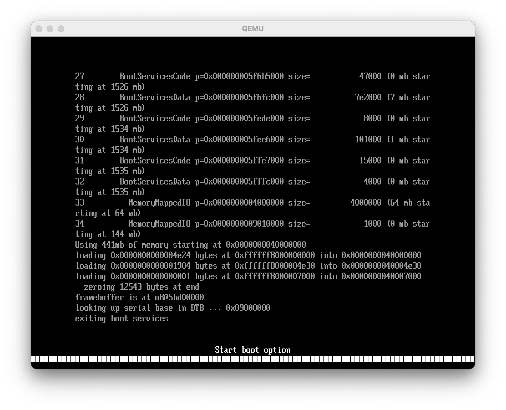
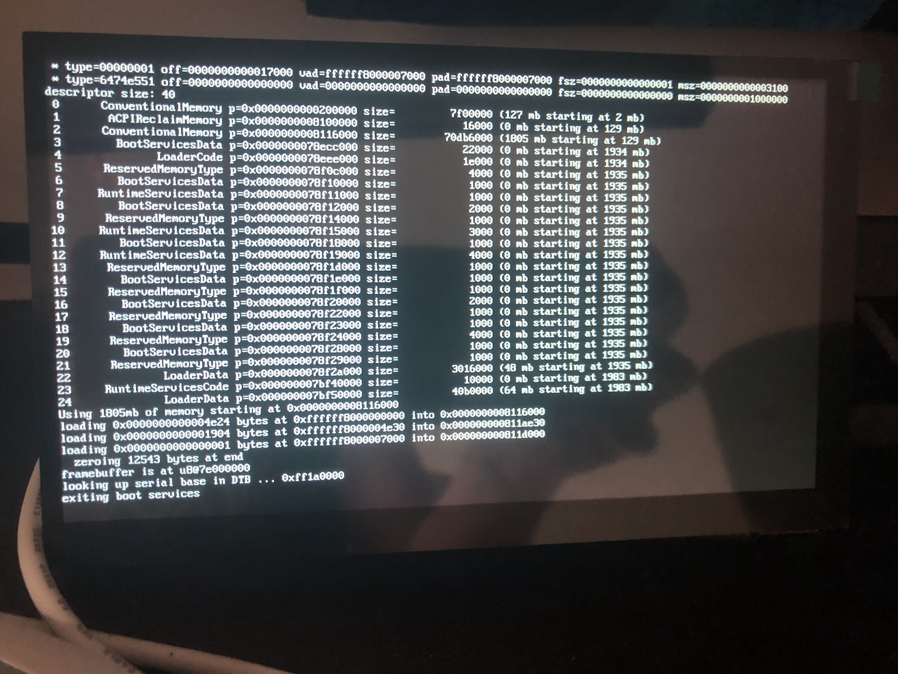

# daintree 

An ARMv8-A operating system, plus a UEFI bootloader, all written in Zig. Currently targetting and testing on:

- QEMU (using HVF acceleration on macOS), with EDK2
- ROCKPro64, with U-Boot ([patch required](https://patchwork.ozlabs.org/project/uboot/patch/20210209062150.mmshhxissljf6fak@talia.n4wrvuuuhszuhem3na2pm5saea.px.internal.cloudapp.net/))

There's a little [dev blog](https://github.com/kivikakk/daintree/discussions/1) I hope to maintain as I go.

## dainboot

A gentle introduction to Zig's UEFI support. Boots like this:

- Checks loaded image options.
  - You can pass `kernel 0x12345678 0x1234` to give it the location of the kernel already loaded in RAM. Useful for TFTP boot, which itself is handy for faster development cycles on bare metal.
  - You may also pass `dtb 0x12345678 0x1234` to give information about a DTB/FDT (device tree blob/flattened device tree) already in memory.
  - Separate successive options with spaces, i.e. `kernel <addr> <len> dtb <addr> <len>`.
- If kernel or DTB (or both) were not loaded from memory, scans filesystems the UEFI system knows about, looking in the root directories for files named `dainkrnl` and `dtb`.
- Picks the biggest unused slab of conventional memory and places the kernel there.
- Parses the DTB and attempts to locate the serial UART port.
- Exits UEFI boot services.
- Jumps to the kernel, passing the memory map, UART port, and framebuffer prepared by UEFI.

|              qemu              |              rockpro64              |
| :----------------------------: | :---------------------------------: |
|  |  |

## dainkrnl

Right now, this just sets up the MMU and implements a small console.

MMU setup works on QEMU, but we don't get this far on bare metal yet. Need to actually reference the memory map.

|                  qemu                  | rockpro64 |
| :------------------------------------: | :-------: |
|  |    wip    |

## license

MIT, per [Zig](https://github.com/ziglang/zig).
