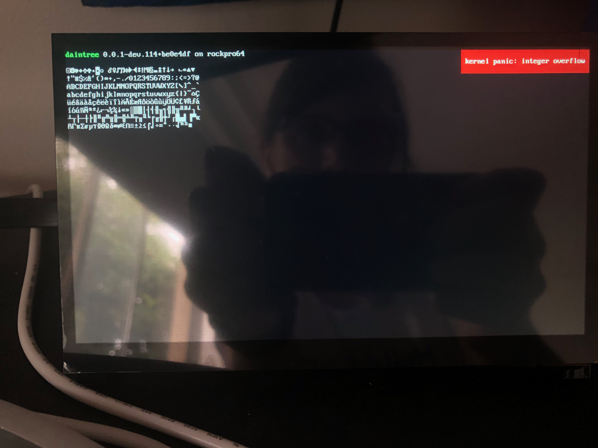
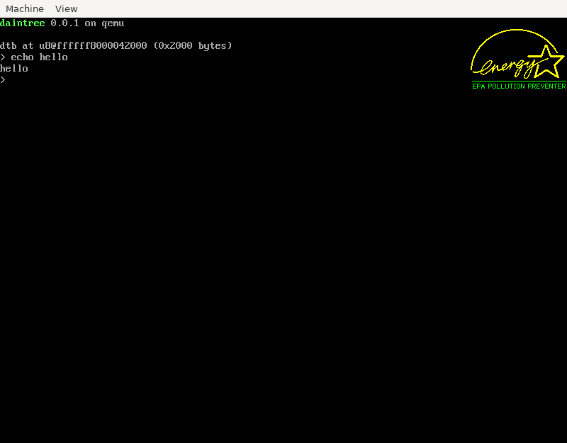

# daintree 

An ARMv8-A operating system, plus a UEFI bootloader, all written in Zig. Currently targetting and testing on:

- QEMU (using HVF acceleration on macOS and TCG on FreeBSD), with U-Boot
  - The U-Boot build is included in the repository, and is based on
    [patch series adding QFW and QEMU ramfb support on Arm](https://git.src.kameliya.ee/~kameliya/u-boot/log/qfw-ramfb).
    I'm hoping to land this in the coming weeks.
- ROCKPro64, with U-Boot
  - A mainline build is okay, but it must contain this
    [EFI loader fix](https://source.denx.de/u-boot/u-boot/-/commit/9d30a941cce5ed055da18398f4deba18830d00d6).
    At time of writing it has not been included in any release.

There's a little [dev blog](https://github.com/kivikakk/daintree/discussions/1)
I hope to maintain as I go.  See also [my personal blog](https://kivikakk.ee):

- 2021-02-28: [Knowing when to look past your code](https://kivikakk.ee/2021/02/28/loader/)
- 2021-02-13: [DTB parser implementing notes](https://kivikakk.ee/2021/02/13/dtb-parser-implementing-notes/)

## dainboot

A gentle introduction to Zig's UEFI support. Boots like this:

- Checks loaded image options.
  - You can pass `kernel 0x12345678 0x1234` to give it the location of the
    kernel already loaded in RAM. Useful for TFTP boot, which itself is handy
    for faster development cycles on bare metal.
  - You may also pass `dtb 0x12345678 0x1234` to give information about a
    DTB/FDT (device tree blob/flattened device tree) already in memory.
  - Separate successive options with spaces, i.e. `kernel <addr> <len> dtb
    <addr> <len>`.
- If DTB wasn't loaded from memory, checks to see if one was passed in via
  UEFI.
- If kernel or DTB (or both) were not loaded from memory, scans filesystems the
  UEFI system knows about, looking in the root directories for files named
  `dainkrnl` and `dtb`.
- Picks the biggest unused slab of conventional memory and places the kernel
  there.
- Clears data and instruction caches for loaded memory.
- Parses the DTB and attempts to locate the serial UART port.
- Exits UEFI boot services.
- If necessary, disables a whole lot of traps and goes to EL1.
- Jumps to the kernel, passing the memory map, UART write port, and framebuffer
  prepared by UEFI.

|              qemu              |              rockpro64              |
| :----------------------------: | :---------------------------------: |
|  |  |

## dainkrnl

- Uses the UART write port to debug before the MMU is enabled.
- Sets up the MMU, mapping the kernel, stack, framebuffer, DTB, UART device,
  etc. into high addresses.
- Parses the DTB to understand what kind of serial device is connected and how
  to access
  [PSCI](https://developer.arm.com/architectures/system-architectures/software-standards/psci).
- Implements a console using a classic VGA font.
- A shell lets you reset or poweroff the system.  You can only use serial for
  input, but the output is muxed to the framebuffer if one is available.

|                  qemu                  |                  rockpro64                  |
| :------------------------------------: | :-----------------------------------------: |
|  |  |
|    | |

## license

MIT, per [Zig](https://github.com/ziglang/zig).

The [`roms/`](roms/) directory contains a build of
[U-Boot](http://www.denx.de/wiki/U-Boot/WebHome), (C) Wolfgang Denk and
licensed under GPL 2.  See [U-Boot's Licensing page](https://www.denx.de/wiki/U-Boot/Licensing)
for details.  The source can be found at
<https://git.src.kameliya.ee/~kameliya/u-boot/log/qfw-ramfb>.
